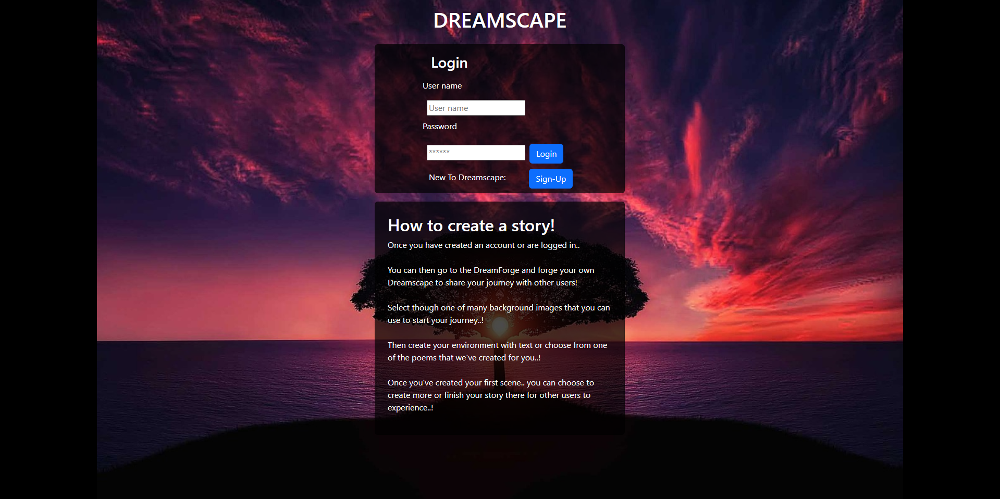

# DreamScape

## Description

Welcome to DreamScape! DreamScape is a web based application built using the MERN stack designed to help you on your mindfulness journey. Build and experience stories crafted by other users as you practice mindfulness.

## Table of Contents

  1. [Usage](#usage)
  2. [Authors](#authors)
  3. [Technologies](#technologies)
  4. [License](#license)
  5. [Questions](#questions)

## Usage

In order to use this application, navigate to the following link:

https://whispering-crag-58704-755d34513186.herokuapp.com/

Following this link should bring you to a landing page like the image below:

If you are an existing user, you may sign in from the form provided. Otherwise, follow the "Sign Up" button to create a new user.

Once a user is signed in, you will be navigated to your Profile page. The profile page is your main hub for all interaction with the application. You can view stories that you have created directly from this page, name and begin to create new stories yourself, or view publically available stories created by other users.

By adding a new Story Title, you will be prompted to add scenes to your new Story. This will navigate you to the DreamForge. The DreamForge is your tool to creating your mindfullness journey stories. Here you must add images and optionally add text (or select from various options of poems). If you would like to add more than one scene, select the 'Next Scene' button. This will save your scene to your story and allow you to create another scene. Add as many scenes as you would like.

When you have completed the last scene you would like to have on your Story, click the 'Finish Story' button. This will complete your story and return you to your Profile hub. Your new story will appear on your Profile page after a few seconds. Clicking on any of your stories (or on any stories from the Story Well) will allow you to experience the Story.

## Authors

[Andrew Nalley](https://github.com/AndrewNalley)

[Andrew Brandstrom](https://github.com/abrand93)

[Chanse Shirley](https://github.com/CaptainFlint1715)

[Nick Reece](https://github.com/nreece6)

[Toumeng Yeng](https://github.com/2meng)

## Technologies

**Client:** React, BootstrapCSS

**Server:** Node, Express, Mongoose

## License

https://github.com/othneildrew/Best-README-Template/blob/master/LICENSE.txt

MIT License

Copyright (c) 2023 Andrew Nalley, Andrew Brandstrom, Chanse Shirley, Nick Reece, Toumeng Yang

Permission is hereby granted, free of charge, to any person obtaining a copy of this software and associated documentation files (the "Software"), to deal in the Software without restriction, including without limitation the rights to use, copy, modify, merge, publish, distribute, sublicense, and/or sell copies of the Software, and to permit persons to whom the Software is furnished to do so, subject to the following conditions:

The above copyright notice and this permission notice shall be included in all copies or substantial portions of the Software.

THE SOFTWARE IS PROVIDED "AS IS", WITHOUT WARRANTY OF ANY KIND, EXPRESS OR IMPLIED, INCLUDING BUT NOT LIMITED TO THE WARRANTIES OF MERCHANTABILITY, FITNESS FOR A PARTICULAR PURPOSE AND NONINFRINGEMENT. IN NO EVENT SHALL THE AUTHORS OR COPYRIGHT HOLDERS BE LIABLE FOR ANY CLAIM, DAMAGES OR OTHER LIABILITY, WHETHER IN AN ACTION OF CONTRACT, TORT OR OTHERWISE, ARISING FROM, OUT OF OR IN CONNECTION WITH THE SOFTWARE OR THE USE OR OTHER DEALINGS IN THE SOFTWARE.

## Questions

Questions? Feel free to message any of the Authors on GitHub.

Thank you for viewing our application! 
